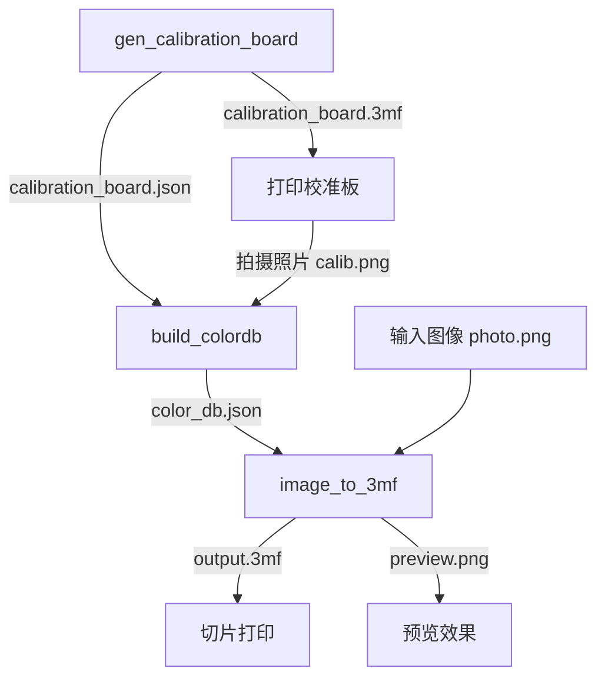

# ChromaPrint3D 应用程序指南

本目录包含 ChromaPrint3D 的全部可执行程序：5 个命令行工具和 1 个 HTTP 服务器。

## 构建

在项目根目录执行：

```bash
cmake -S . -B build -DCMAKE_BUILD_TYPE=Release
cmake --build build -j
```

构建产物位于 `build/bin/`：

| 可执行文件 | 功能 |
|---|---|
| `gen_calibration_board` | 生成校准板 3MF 模型与元数据 |
| `build_colordb` | 从校准板照片构建 ColorDB |
| `image_to_3mf` | 将图像转换为多色 3MF 模型 |
| `gen_representative_board` | 从配方集生成代表性校准板 |
| `gen_stage` | 生成阶梯校准模型 |
| `chromaprint3d_server` | HTTP 服务器，提供 Web API |

## 典型工作流程



> 所有工具均支持 `--help` / `-h` 查看帮助，`--log-level` 设置日志级别（trace / debug / info / warn / error / off，默认 info）。

---

## 命令行工具

### gen_calibration_board

生成用于颜色校准的 3MF 校准板模型及其元数据 JSON。元数据包含色块布局、配方索引等信息，供后续 `build_colordb` 使用。

**参数**

| 参数 | 类型 | 默认值 | 说明 |
|---|---|---|---|
| `--channels N` | int | `4` | 颜色通道数（2–8） |
| `--out PATH` | string | `calibration_board.3mf` | 输出 3MF 文件路径 |
| `--meta PATH` | string | `calibration_board.json` | 输出元数据 JSON 路径 |
| `--scale N` | int | 配置默认 | 分辨率缩放倍数 |
| `--log-level LEVEL` | string | `info` | 日志级别 |

默认调色板（按通道数自动分配）：

- 4 通道：White, Yellow, Red, Blue
- 3 通道：White, Gray, Black
- 2 通道：Color A, Color B
- 其他：Channel 0, Channel 1, ...

材质统一为 `PLA Basic`。

**示例**

```bash
# 生成 4 通道校准板
gen_calibration_board --channels 4 --out board.3mf --meta board.json

# 生成 5 通道校准板，2 倍分辨率
gen_calibration_board --channels 5 --scale 2
```

---

### build_colordb

从打印并拍摄的校准板照片与元数据 JSON 构建 ColorDB。程序会自动定位照片中的校准板区域、提取各色块颜色，并与配方对应生成颜色数据库。

**参数**

| 参数 | 类型 | 默认值 | 说明 |
|---|---|---|---|
| `--image PATH` | string | *必填* | 校准板照片文件 |
| `--meta PATH` | string | *必填* | 校准板元数据 JSON |
| `--out PATH` | string | `<image_stem>_colordb.json` | 输出 ColorDB JSON 路径 |
| `--log-level LEVEL` | string | `info` | 日志级别 |

**示例**

```bash
# 从照片和元数据生成 ColorDB
build_colordb --image calib_photo.png --meta board.json --out my_colordb.json

# 使用默认输出路径（calib_photo_colordb.json）
build_colordb --image calib_photo.png --meta board.json
```

---

### image_to_3mf

将输入图像转换为多色 3MF 模型。使用 ColorDB 进行颜色匹配，可选使用模型包（model pack）进行 AI 辅助匹配。同时输出预览图和源 mask 图。

**参数**

| 参数 | 类型 | 默认值 | 说明 |
|---|---|---|---|
| `--image PATH` | string | *必填* | 输入图像文件 |
| `--db PATH` | string | *必填* | ColorDB 文件或目录（可重复指定多个） |
| `--out PATH` | string | `<image_stem>.3mf` | 输出 3MF 文件路径 |
| `--preview PATH` | string | `<out_stem>_preview.png` | 预览图输出路径 |
| `--source-mask PATH` | string | `<out_stem>_source_mask.png` | 源 mask 图输出路径 |

图像处理参数：

| 参数 | 类型 | 默认值 | 说明 |
|---|---|---|---|
| `--scale S` | float | `1.0` | 图像预处理缩放比例 |
| `--max-width N` | int | `512` | 最大宽度（0 = 不限制） |
| `--max-height N` | int | `512` | 最大高度（0 = 不限制） |
| `--flip-y 0\|1` | bool | `1` | 构建模型时翻转 Y 轴 |
| `--pixel-mm X` | float | ColorDB 值 | 像素尺寸（mm） |
| `--layer-mm X` | float | ColorDB 值 | 层高（mm） |

颜色匹配参数：

| 参数 | 类型 | 默认值 | 说明 |
|---|---|---|---|
| `--mode 0.08x5\|0.04x10` | string | `0.08x5` | 打印模式（层高×颜色层数） |
| `--color-space lab\|rgb` | string | `lab` | 颜色匹配空间 |
| `--k N` | int | `1` | Top-K 候选数 |
| `--clusters N` | int | `64` | 聚类数（≤1 禁用聚类） |

模型匹配参数（需提供 `--model-pack`）：

| 参数 | 类型 | 默认值 | 说明 |
|---|---|---|---|
| `--model-pack PATH` | string | 无 | 模型包 JSON 路径 |
| `--model-enable 0\|1` | bool | `1` | 启用模型回退 |
| `--model-only 0\|1` | bool | `0` | 仅使用模型匹配 |
| `--model-threshold X` | float | 模型包默认 | 模型回退阈值（DeltaE76） |
| `--model-margin X` | float | 模型包默认 | 模型回退边界（DeltaE76） |

**示例**

```bash
# 基本转换
image_to_3mf --image photo.png --db colordb.json

# 使用多个 ColorDB + 模型包，自定义输出
image_to_3mf --image photo.png \
  --db colordb1.json --db colordb2.json \
  --model-pack model_package.json \
  --out result.3mf \
  --mode 0.04x10 --color-space lab --clusters 128

# 高分辨率转换，禁用聚类
image_to_3mf --image photo.png --db ./dbs/ \
  --max-width 1024 --max-height 1024 --clusters 0
```

---

### gen_representative_board

从一组配方数据生成代表性校准板。用于将已有配方集合可视化为 32×32 的校准板模型，便于验证配方覆盖情况。

**参数**

| 参数 | 类型 | 默认值 | 说明 |
|---|---|---|---|
| `--recipes PATH` | string | *必填* | 配方 JSON 文件（需 ≥1024 条） |
| `--ref-db PATH` | string | 无 | 参考 ColorDB JSON（提供调色板/层高等默认值） |
| `--out PATH` | string | `representative_board.3mf` | 输出 3MF 文件路径 |
| `--meta PATH` | string | `<out_stem>.json` | 输出元数据 JSON 路径 |
| `--scale N` | int | 配置默认 | 分辨率缩放倍数 |
| `--log-level LEVEL` | string | `info` | 日志级别 |

配方 JSON 格式支持两种形式：

```json
// 形式 1：纯数组
[[0,1,0,1,0], [1,0,1,0,1], ...]

// 形式 2：带元数据的对象
{
  "palette": [{"color": "White", "material": "PLA Basic"}, ...],
  "layer_height_mm": 0.08,
  "line_width_mm": 0.42,
  "base_layers": 10,
  "base_channel_idx": 0,
  "layer_order": "Top2Bottom",
  "recipes": [[0,1,0,1,0], ...]
}
```

若使用形式 2 且包含完整元数据，则无需 `--ref-db`。

**示例**

```bash
# 从配方文件和参考数据库生成
gen_representative_board --recipes recipes.json --ref-db colordb.json

# 配方文件已包含完整元数据
gen_representative_board --recipes full_recipes.json --out board.3mf
```

---

### gen_stage

生成阶梯模型 3MF，用于校准打印机的多层精度。模型包含 6×3 = 18 个方块，每个方块的层数不同（0–16 层 + 25 层），用于验证不同厚度的打印效果。

**参数**

| 参数 | 类型 | 默认值 | 说明 |
|---|---|---|---|
| `--out PATH` | string | `stage.3mf` | 输出 3MF 文件路径 |
| `--log-level LEVEL` | string | `info` | 日志级别 |

内置配置（不可通过命令行修改）：

| 属性 | 值 |
|---|---|
| 网格布局 | 6 列 × 3 行（18 个方块） |
| 方块尺寸 | 10 mm |
| 间距 | 1 mm |
| 像素尺寸 | 1.0 mm |
| 层高 | 0.04 mm |
| 底座厚度 | 1.0 mm |
| 阶梯层数 | 0, 1, 2, ..., 16, 25 |

**示例**

```bash
gen_stage --out my_stage.3mf
```

---

## HTTP 服务器

### chromaprint3d_server

提供 RESTful API 的 HTTP 服务器，支持校准板生成、ColorDB 管理、图像转换等功能。可选挂载 Web 前端静态文件。

**启动参数**

| 参数 | 类型 | 默认值 | 说明 |
|---|---|---|---|
| `--data DIR` | string | *必填* | ColorDB 数据目录 |
| `--port PORT` | int | `8080` | 监听端口 |
| `--host HOST` | string | `0.0.0.0` | 绑定地址 |
| `--model-pack PATH` | string | 无 | 模型包 JSON 路径 |
| `--web DIR` | string | 无 | Web 前端静态文件目录 |
| `--max-upload-mb N` | int | `50` | 最大上传大小（MB） |
| `--max-tasks N` | int | `4` | 最大并发任务数 |
| `--task-ttl N` | int | `3600` | 任务 TTL（秒） |
| `--log-level LEVEL` | string | `info` | 日志级别 |

**启动示例**

```bash
# 最小启动
chromaprint3d_server --data ./data/dbs

# 完整配置
chromaprint3d_server \
  --data ./data/dbs \
  --model-pack ./data/model_pack/model_package.json \
  --web ./web/dist \
  --port 8080 \
  --max-tasks 8 \
  --max-upload-mb 100 \
  --log-level info
```

启动后访问 `http://localhost:8080` 即可使用 Web 界面（需指定 `--web`）。

---

### API 参考

所有 API 端点以 `/api/` 为前缀，请求和响应均为 JSON（除文件下载外）。所有响应包含 CORS 头。

#### Health

##### `GET /api/health`

服务器健康检查。

**响应**

```json
{
  "status": "ok",
  "version": "0.1.0",
  "active_tasks": 1,
  "total_tasks": 5
}
```

---

#### 校准板（Calibration）

##### `POST /api/calibration/generate-board`

生成校准板，返回 board ID 和元数据。服务端会缓存相同通道数的几何数据以加速后续请求。

**请求体**

```json
{
  "palette": [
    {"color": "White", "material": "PLA Basic"},
    {"color": "Red", "material": "PLA Basic"},
    {"color": "Blue", "material": "PLA Basic"}
  ],
  "color_layers": 5,
  "layer_height_mm": 0.08
}
```

| 字段 | 类型 | 必填 | 说明 |
|---|---|---|---|
| `palette` | array | 是 | 调色板（2–8 个通道），每项含 `color` 和 `material` |
| `color_layers` | int | 否 | 颜色层数 |
| `layer_height_mm` | float | 否 | 层高（mm） |

**响应** `200`

```json
{
  "board_id": "a1b2c3d4-...",
  "meta": { ... }
}
```

##### `GET /api/calibration/boards/:id/3mf`

下载校准板 3MF 文件。

**响应** 二进制文件（`application/vnd.ms-package.3dmanufacturing-3dmodel+xml`）

##### `GET /api/calibration/boards/:id/meta`

下载校准板元数据 JSON 文件。

**响应** JSON 文件下载

##### `POST /api/calibration/build-colordb`

从校准板照片和元数据构建 ColorDB。

**请求** `multipart/form-data`

| 字段 | 类型 | 必填 | 说明 |
|---|---|---|---|
| `image` | file | 是 | 校准板照片 |
| `meta` | file | 是 | 元数据 JSON 文件 |
| `name` | string | 否 | ColorDB 名称（字母数字和下划线，1–64 字符） |

**响应** `200` — ColorDB JSON 对象

---

#### 图像转换（Convert / Tasks）

##### `POST /api/convert`

提交图像转换任务（异步）。

**请求** `multipart/form-data`

| 字段 | 类型 | 必填 | 说明 |
|---|---|---|---|
| `image` | file | 是 | 输入图像文件 |
| `params` | string | 否 | 转换参数 JSON 字符串 |

**响应** `202`

```json
{
  "task_id": "task-uuid-..."
}
```

##### `GET /api/tasks`

查询所有任务列表。

**响应** `200`

```json
{
  "tasks": [
    {
      "task_id": "...",
      "status": "completed",
      "progress": 100,
      ...
    }
  ]
}
```

##### `GET /api/tasks/:id`

查询单个任务状态。

**响应** `200` — 任务信息对象 | `404` — 任务不存在

##### `GET /api/tasks/:id/result`

下载转换结果 3MF 文件。

**响应** 二进制文件 | `409` — 任务未完成 | `404` — 不存在

##### `GET /api/tasks/:id/preview`

下载预览图（PNG）。

**响应** 二进制文件 | `409` — 任务未完成 | `404` — 不存在

##### `GET /api/tasks/:id/source-mask`

下载源 mask 图（PNG）。

**响应** 二进制文件 | `409` — 任务未完成 | `404` — 不存在

##### `DELETE /api/tasks/:id`

删除任务。运行中的任务无法删除。

**响应** `200` — `{"deleted": true}` | `409` — 任务运行中 | `404` — 不存在

---

#### ColorDB

##### `GET /api/colordbs`

获取可用 ColorDB 列表（包括全局和当前会话的）。

**响应** `200`

```json
{
  "databases": [
    {
      "name": "RYBW_008_5L",
      "source": "global",
      ...
    }
  ]
}
```

##### `GET /api/config/defaults`

获取默认转换参数配置。

**响应** `200`

```json
{
  "scale": 1.0,
  "max_width": 512,
  "max_height": 512,
  "print_mode": "0.08x5",
  "color_space": "lab",
  "k_candidates": 1,
  "cluster_count": 64,
  "model_enable": true,
  "model_only": false,
  "flip_y": true,
  "generate_preview": true,
  "generate_source_mask": true
}
```

---

#### 会话（Session）

会话通过 HTTP 请求头中的 session token 识别。会话 ColorDB 仅对当前会话可见。

##### `GET /api/session/colordbs`

获取当前会话的 ColorDB 列表。

**响应** `200` — `{"databases": [...]}`

##### `POST /api/session/colordbs/upload`

上传 ColorDB JSON 文件到当前会话。

**请求** `multipart/form-data`

| 字段 | 类型 | 必填 | 说明 |
|---|---|---|---|
| `file` | file | 是 | ColorDB JSON 文件 |
| `name` | string | 否 | 覆盖 ColorDB 名称 |

**响应** `200` — ColorDB 对象 | `409` — 名称与全局数据库冲突 | `429` — 会话数据库数量超限

##### `GET /api/session/colordbs/:name/download`

下载会话中指定名称的 ColorDB 文件。

**响应** JSON 文件下载 | `404` — 不存在

##### `DELETE /api/session/colordbs/:name`

删除会话中指定名称的 ColorDB。

**响应** `200` — `{"deleted": true}` | `404` — 不存在

---

#### CORS

##### `OPTIONS /(.*)`

CORS 预检请求处理，返回 `204 No Content`。
