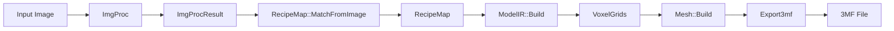
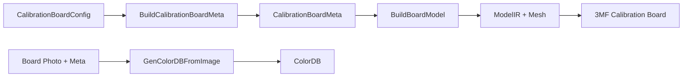

# ChromaPrint3D Core

> [中文版](README.md)

ChromaPrint3D Core is a C++20 static library that provides a complete conversion pipeline from images to multi-color 3D printing models. It maps input image colors to multi-channel printing recipes, then generates slicer-ready 3MF model files through voxelization and meshing.

## Key Capabilities

- Image preprocessing (resize, denoise, alpha mask, color space conversion)
- ColorDB-based color matching and recipe generation (Lab / RGB color spaces)
- Optional ML model-assisted matching (ModelPackage)
- Recipe map (RecipeMap) to voxel grid (VoxelGrid) conversion
- Greedy meshing for triangle mesh generation
- 3MF model export (file or in-memory buffer)
- Calibration board generation and color database construction
- End-to-end conversion pipeline (`Convert` single-call API)

## Data Pipeline

### Image to 3MF Main Flow



**Stage Details:**

| Stage | Input | Output | Description |
|-------|-------|--------|-------------|
| ImgProc | Image file/buffer | ImgProcResult | Resize, denoise, extract alpha mask, convert to linear RGB and Lab |
| MatchFromImage | ImgProcResult + ColorDB | RecipeMap | K-Means color quantization, match each pixel to nearest recipe |
| ModelIR::Build | RecipeMap + ColorDB | VoxelGrids | Expand per-pixel recipes into per-channel voxel occupancy grids |
| Mesh::Build | VoxelGrid | Mesh | Greedy meshing on each channel's voxels to produce triangle mesh |
| Export3mf | Mesh[] | 3MF | Write all channel meshes into 3MF format (lib3mf) |

### Calibration Board Flow



Users first generate and print a calibration board 3MF, then photograph the printed result and combine it with the Meta to build a ColorDB, which can then be used in the image-to-3MF main flow.

## Directory Structure

```
core/
├── include/chromaprint3d/      # Public headers (available after installation)
│   ├── chromaprint3d.h         # Umbrella header
│   ├── version.h.in            # Version template (CMake generates version.h)
│   ├── export.h                # Export/visibility macros
│   ├── error.h                 # Exception hierarchy
│   ├── common.h                # Common enumerations
│   ├── vec3.h                  # 3D vector types
│   ├── color.h                 # Color types and color space conversions
│   ├── kdtree.h                # KD-Tree template
│   ├── color_db.h              # Color database
│   ├── imgproc.h               # Image preprocessing
│   ├── recipe_map.h            # Recipe mapping
│   ├── print_profile.h         # Print profile configuration
│   ├── model_package.h         # ML model package
│   ├── voxel.h                 # Voxel grids and ModelIR
│   ├── mesh.h                  # Triangle mesh
│   ├── export_3mf.h            # 3MF export
│   ├── calib.h                 # Calibration board
│   ├── pipeline.h              # Conversion pipeline
│   ├── encoding.h              # Image encoding
│   └── logging.h               # Logging initialization
│
├── src/                        # Source implementation (organized by module)
│   ├── common/                 # Common utilities
│   ├── color_db/               # ColorDB implementation
│   ├── imgproc/                # Image preprocessing
│   ├── match/                  # Color matching engine
│   │   └── detail/             # Internal helper headers
│   ├── calib/                  # Calibration board generation and detection
│   ├── geo/                    # Voxels, meshes, 3MF export
│   ├── pipeline/               # Conversion pipeline
│   ├── encoding/               # Image encoding
│   ├── logging/                # Logging initialization
│   └── detail/                 # Internal shared utilities
│       ├── cv_utils.h          # OpenCV helper functions
│       └── json_utils.h        # JSON parsing helpers
│
├── tests/                      # Unit tests
└── CMakeLists.txt              # Build configuration
```

## Module Reference

### common — Common Enumerations and Types

**Header:** `common.h`

Defines widely-used enumeration types throughout the library:

| Type | Description |
|------|-------------|
| `ResizeMethod` | Image resize algorithm (Nearest / Area / Linear / Cubic) |
| `DenoiseMethod` | Denoising algorithm (None / Bilateral / Median) |
| `LayerOrder` | Layer direction (Top2Bottom / Bottom2Top) |
| `ColorSpace` | Matching color space (Lab / Rgb) |

Provides `LayerOrder` string conversion functions: `ToLayerOrderString()` / `FromLayerOrderString()`.

### error — Exception Hierarchy

**Header:** `error.h`

All public functions throw subclasses of `ChromaPrint3D::Error` instead of bare `std::runtime_error`, enabling category-based catching:

| Exception | ErrorCode | Meaning |
|-----------|-----------|---------|
| `InputError` | InvalidInput | Invalid input arguments or data |
| `IOError` | IOError | File/stream I/O failure |
| `FormatError` | FormatError | Data format/parsing error (JSON, 3MF, etc.) |
| `ConfigError` | ConfigMismatch | Incompatible configuration (channel count, layer height, etc.) |
| `MatchError` | NoValidCandidate | Color matching found no usable candidate |

### vec3 / color — Math and Color Foundations

**Headers:** `vec3.h`, `color.h`

- `Vec3i`: Integer 3-component vector (voxel coordinates, mesh indices)
- `Vec3f`: Float 3-component vector (normalization, distance, interpolation, clamping)
- `Rgb`: Linear sRGB color (components in [0, 1]), with Lab interconversion and gamma encode/decode
- `Lab`: CIE L\*a\*b\* color, provides `DeltaE76` color difference computation

Color space conversion chain: sRGB gamma ↔ linear RGB ↔ XYZ (D65) ↔ L\*a\*b\*

### kdtree — KD-Tree Nearest Neighbor Search

**Header:** `kdtree.h`

Templated KD-Tree implementation supporting:
- `Nearest()` — Nearest neighbor query
- `KNearest()` — K nearest neighbor query
- `RadiusSearch()` — Radius-based range search

Uses projection functions for non-intrusive indexing; used by ColorDB for fast color lookups in Lab/RGB space.

### color_db — Color Database

**Header:** `color_db.h`

`ColorDB` is one of the core data structures, storing color recipes and their corresponding Lab values:

- `Entry`: A color record (Lab value + recipe vector)
- `Channel`: Channel descriptor (color name, material name)
- `ColorDB`: Complete database
  - JSON serialization/deserialization (`LoadFromJson` / `SaveToJson` / `FromJsonString` / `ToJsonString`)
  - KD-Tree indexed nearest neighbor queries (`NearestEntry` / `NearestEntries`)
  - Configuration: palette, layer height, line width, layer order

### imgproc — Image Preprocessing

**Header:** `imgproc.h`

The `ImgProc` class processes input images into the format required by the matching engine:

1. **Loading**: Supports file path, cv::Mat, or in-memory buffer
2. **Resizing**: Auto-adjusts dimensions based on scale / max_width / max_height
3. **Denoising**: Optional Bilateral / Median filtering
4. **Alpha mask extraction**: Generates pixel validity mask from alpha channel
5. **Color space conversion**: Outputs linear RGB (CV_32FC3) and CIE Lab (CV_32FC3)

Produces `ImgProcResult` containing `rgb`, `lab`, and `mask` matrices.

### match — Color Matching Engine

**Headers:** `recipe_map.h`, `print_profile.h`, `model_package.h`

Color matching is the library's core algorithm, mapping image pixels to the nearest printing recipe:

**Matching Flow:**
1. K-Means color quantization on the image (`cluster_count` clusters)
2. For each cluster center, search ColorDB for `k_candidates` nearest candidates
3. Optionally use ModelPackage for assisted filtering/substitution
4. Propagate matching results to all pixels

**Key Types:**

| Type | Description |
|------|-------------|
| `RecipeMap` | Matching result: per-pixel recipes + mapped colors + source mask |
| `MatchConfig` | Matching parameters (candidate count, color space, cluster count) |
| `MatchStats` | Matching statistics (total clusters, DB hits, model fallbacks, etc.) |
| `PrintProfile` | Print configuration (mode, layer height, color layers, palette) |
| `PrintMode` | Print mode enum (0.08mm x 5 layers / 0.04mm x 10 layers) |
| `ModelPackage` | ML model package with precomputed candidate recipes and predicted Lab values |
| `ModelGateConfig` | Model gate configuration (threshold, margin, enable flags) |

### geo — Geometry Processing

**Headers:** `voxel.h`, `mesh.h`

Converts recipe maps into 3D geometry:

- `VoxelGrid`: Dense boolean occupancy grid (H x W x L), one per channel
- `ModelIR`: Intermediate representation containing multiple VoxelGrids + palette info
- `ModelIR::Build()`: Builds voxel grids from RecipeMap + ColorDB (OpenMP parallelized)
- `Mesh`: Indexed triangle mesh (vertices + indices)
- `Mesh::Build()`: Greedy meshing to generate surface mesh from VoxelGrid

### export_3mf — 3MF Export

**Header:** `export_3mf.h`

Multi-channel 3MF model export based on lib3mf:

| Function | Description |
|----------|-------------|
| `Export3mf()` | Export ModelIR to a 3MF file |
| `Export3mfToBuffer()` | Export ModelIR to an in-memory buffer |
| `Export3mfFromMeshes()` | Export from pre-built Mesh vector (for caching scenarios) |

Mesh building supports OpenMP channel-level parallelism.

### calib — Calibration Board

**Header:** `calib.h`

The calibration board system establishes the mapping between actual printed colors and recipes:

**Board Generation:**
- `CalibrationBoardConfig`: Board configuration (channel count, color layers, layout params)
- `CalibrationRecipeSpec`: Recipe specification (`num_channels^color_layers` recipe permutations)
- `GenCalibrationBoard()`: Generate calibration board 3MF + Meta JSON
- `GenCalibrationBoardMeshes()`: Generate intermediate mesh results (for server-side geometry caching)

**ColorDB Construction:**
- `GenColorDBFromImage()`: Build ColorDB from calibration board photo + Meta
- Supports both file path and in-memory buffer inputs

**Caching Optimization:**
- `CalibrationBoardMeshes`: Stores pre-built mesh vectors
- `BuildResultFromMeshes()`: Quickly rebuild results from cached meshes + new palette

### pipeline — Conversion Pipeline

**Header:** `pipeline.h`

The `Convert()` function provides an end-to-end image-to-3MF pipeline:

```cpp
ConvertResult result = Convert(request);
```

`ConvertRequest` encapsulates all parameters:
- Image input (path or buffer)
- ColorDB input (paths or preloaded instances)
- Optional ModelPackage
- Image processing parameters (scale, max_width/height)
- Matching parameters (print_mode, color_space, k_candidates, cluster_count)
- Geometry parameters (flip_y, pixel_mm, layer_height_mm)
- Output control (whether to generate preview and source mask images)

`ConvertResult` contains:
- `model_3mf`: 3MF model buffer
- `preview_png`: Preview image PNG buffer
- `source_mask_png`: Source mask PNG buffer
- `stats`: Matching statistics

Supports `ProgressCallback` for stage-based progress reporting (LoadingResources → ProcessingImage → Matching → BuildingModel → Exporting).

### encoding — Image Encoding

**Header:** `encoding.h`

Encodes OpenCV Mat to image formats:
- `EncodePng()`: Encode to PNG buffer
- `EncodeJpeg()`: Encode to JPEG buffer (configurable quality)
- `SaveImage()`: Save to file

### logging — Logging

**Header:** `logging.h`

spdlog-based logging initialization:
- `InitLogging()`: Set up global logger and level
- `ParseLogLevel()`: Parse log level from string

## External Dependencies

| Dependency | Purpose | Linking |
|------------|---------|---------|
| **OpenCV** | Image loading, resizing, denoising, color conversion, encoding | `opencv_core` `opencv_imgproc` `opencv_imgcodecs` |
| **lib3mf** | 3MF file format read/write | `lib3mf` |
| **spdlog** | Structured logging | `spdlog::spdlog_header_only` |
| **nlohmann/json** | JSON serialization (header-only, via 3dparty directory) | Header-only |
| **OpenMP** | Optional parallel acceleration (voxel building, mesh generation) | `OpenMP::OpenMP_CXX` (auto-detected) |

## Building and Integration

### CMake Target

```cmake
# Library target
add_library(chromaprint3d STATIC)
add_library(ChromaPrint3D::core ALIAS chromaprint3d)
```

### Using in a Parent Project

```cmake
target_link_libraries(your_target PRIVATE ChromaPrint3D::core)
```

Linking `ChromaPrint3D::core` automatically propagates all public dependencies (OpenCV, lib3mf, spdlog, OpenMP).

### Version Numbers

Version numbers are managed centrally via `PROJECT_VERSION` in the top-level `CMakeLists.txt`, generated through `configure_file()` into `version.h`:

```cpp
#include <chromaprint3d/version.h>

CHROMAPRINT3D_VERSION_MAJOR   // Major version
CHROMAPRINT3D_VERSION_MINOR   // Minor version
CHROMAPRINT3D_VERSION_PATCH   // Patch version
CHROMAPRINT3D_VERSION_STRING  // Full version string, e.g. "1.2.0"
```

### Umbrella Header

```cpp
#include <chromaprint3d/chromaprint3d.h>  // Includes all public headers
```

Or include individual headers as needed:

```cpp
#include <chromaprint3d/pipeline.h>   // Conversion pipeline only
#include <chromaprint3d/color_db.h>   // Color database only
```
