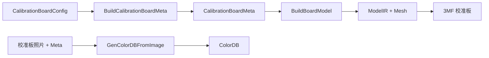

# ChromaPrint3D Core

> [English Version](README.en.md)

ChromaPrint3D Core 是一个 C++20 静态库，提供从图像到多色 3D 打印模型的完整转换流水线。它将输入图像的颜色映射为多通道打印配方（recipe），再经过体素化和网格化生成可直接用于切片的 3MF 模型文件。

## 核心能力

- 图像预处理（缩放、去噪、透明度掩码、色彩空间转换）
- 基于 ColorDB 的颜色匹配与配方生成（支持 Lab / RGB 色彩空间）
- 可选的 ML 模型辅助匹配（ModelPackage）
- 配方映射（RecipeMap）到体素网格（VoxelGrid）的转换
- 贪心网格合并（Greedy Meshing）生成三角网格
- 3MF 模型导出（文件或内存缓冲区）
- 校准板生成与颜色数据库构建
- 端到端转换管线（`Convert` 一键调用）

## 数据流水线

### 图像转 3MF 主流程


**各阶段说明：**

| 阶段 | 输入 | 输出 | 说明 |
|------|------|------|------|
| ImgProc | 图像文件/缓冲区 | ImgProcResult | 缩放、去噪、提取 Alpha 掩码、转换为线性 RGB 和 Lab |
| MatchFromImage | ImgProcResult + ColorDB | RecipeMap | 对图像进行 K-Means 量化，为每个像素匹配最近的配方 |
| ModelIR::Build | RecipeMap + ColorDB | VoxelGrids | 将每像素配方展开为每通道的体素占用网格 |
| Mesh::Build | VoxelGrid | Mesh | 对每个通道的体素执行贪心合并，生成三角网格 |
| Export3mf | Mesh[] | 3MF | 将所有通道网格写入 3MF 格式（lib3mf） |

### 校准板流程



用户先生成校准板 3MF 并打印，拍摄打印结果后结合 Meta 反向构建 ColorDB，即可用于图像转 3MF 主流程。

## 目录结构

```
core/
├── include/chromaprint3d/      # 公共头文件（安装后可供外部使用）
│   ├── chromaprint3d.h         # 总包含头文件
│   ├── version.h.in            # 版本号模板（CMake 生成 version.h）
│   ├── export.h                # 导出/可见性宏
│   ├── error.h                 # 异常层次
│   ├── common.h                # 公共枚举
│   ├── vec3.h                  # 3D 向量类型
│   ├── color.h                 # 颜色类型与色彩空间转换
│   ├── kdtree.h                # KD-Tree 模板
│   ├── color_db.h              # 颜色数据库
│   ├── imgproc.h               # 图像预处理
│   ├── recipe_map.h            # 配方映射
│   ├── print_profile.h         # 打印配置
│   ├── model_package.h         # ML 模型包
│   ├── voxel.h                 # 体素网格与 ModelIR
│   ├── mesh.h                  # 三角网格
│   ├── export_3mf.h            # 3MF 导出
│   ├── calib.h                 # 校准板
│   ├── pipeline.h              # 转换管线
│   ├── encoding.h              # 图像编码
│   └── logging.h               # 日志初始化
│
├── src/                        # 源码实现（按模块组织）
│   ├── common/                 # 公共工具实现
│   ├── color_db/               # ColorDB 实现
│   ├── imgproc/                # 图像预处理实现
│   ├── match/                  # 颜色匹配引擎
│   │   └── detail/             # 内部辅助头文件
│   ├── calib/                  # 校准板生成与定位
│   ├── geo/                    # 体素、网格、3MF 导出
│   ├── pipeline/               # 转换管线
│   ├── encoding/               # 图像编码
│   ├── logging/                # 日志初始化
│   └── detail/                 # 内部共享工具
│       ├── cv_utils.h          # OpenCV 辅助函数
│       └── json_utils.h        # JSON 解析辅助
│
├── tests/                      # 单元测试
└── CMakeLists.txt              # 构建配置
```

## 模块详解

### common — 公共枚举与类型

**头文件：** `common.h`

定义了库中广泛使用的枚举类型：

| 类型 | 说明 |
|------|------|
| `ResizeMethod` | 图像缩放算法（Nearest / Area / Linear / Cubic） |
| `DenoiseMethod` | 去噪算法（None / Bilateral / Median） |
| `LayerOrder` | 层序方向（Top2Bottom / Bottom2Top） |
| `ColorSpace` | 匹配色彩空间（Lab / Rgb） |

提供 `LayerOrder` 与字符串的互转函数 `ToLayerOrderString()` / `FromLayerOrderString()`。

### error — 异常层次

**头文件：** `error.h`

所有公共函数抛出 `ChromaPrint3D::Error` 的子类，而非裸 `std::runtime_error`，便于调用方按类别捕获：

| 异常类 | ErrorCode | 含义 |
|--------|-----------|------|
| `InputError` | InvalidInput | 无效的输入参数或数据 |
| `IOError` | IOError | 文件/流 I/O 错误 |
| `FormatError` | FormatError | 数据格式/解析错误（JSON、3MF 等） |
| `ConfigError` | ConfigMismatch | 配置不兼容（通道数、层高不一致等） |
| `MatchError` | NoValidCandidate | 颜色匹配未找到可用候选 |

### vec3 / color — 数学与颜色基础

**头文件：** `vec3.h`、`color.h`

- `Vec3i`：整型三分量向量（用于体素坐标、网格索引）
- `Vec3f`：浮点三分量向量（支持归一化、距离、插值、钳位等操作）
- `Rgb`：线性 sRGB 颜色（各分量 [0, 1]），支持与 Lab 互转、gamma 编解码
- `Lab`：CIE L\*a\*b\* 颜色，提供 `DeltaE76` 色差计算

色彩空间转换链路：sRGB gamma ↔ 线性 RGB ↔ XYZ (D65) ↔ L\*a\*b\*

### kdtree — KD-Tree 最近邻搜索

**头文件：** `kdtree.h`

模板化 KD-Tree 实现，支持：
- `Nearest()` — 最近邻查询
- `KNearest()` — K 近邻查询
- `RadiusSearch()` — 半径范围搜索

通过投影函数 (Projection) 实现非侵入式索引，在 ColorDB 中用于 Lab/RGB 空间的快速颜色检索。

### color_db — 颜色数据库

**头文件：** `color_db.h`

`ColorDB` 是核心数据结构之一，存储颜色配方与其对应的 Lab 色值：

- `Entry`：一条颜色记录（Lab 色值 + 配方向量）
- `Channel`：通道描述（颜色名、材料名）
- `ColorDB`：完整数据库
  - JSON 序列化/反序列化（`LoadFromJson` / `SaveToJson` / `FromJsonString` / `ToJsonString`）
  - KD-Tree 索引的最近邻查询（`NearestEntry` / `NearestEntries`）
  - 配置信息：palette、层高、线宽、层序

### imgproc — 图像预处理

**头文件：** `imgproc.h`

`ImgProc` 类负责将输入图像处理为匹配引擎所需的格式：

1. **加载**：支持文件路径、cv::Mat 或内存缓冲区
2. **缩放**：根据 scale / max_width / max_height 自动调整尺寸
3. **去噪**：可选 Bilateral / Median 滤波
4. **Alpha 掩码提取**：从透明通道生成像素有效性掩码
5. **色彩空间转换**：输出线性 RGB（CV_32FC3）和 CIE Lab（CV_32FC3）

输出 `ImgProcResult`，包含 `rgb`、`lab`、`mask` 三个矩阵。

### match — 颜色匹配引擎

**头文件：** `recipe_map.h`、`print_profile.h`、`model_package.h`

颜色匹配是库的核心算法，将图像像素映射到最近的打印配方：

**匹配流程：**
1. 使用 K-Means 对图像进行颜色量化（`cluster_count` 个聚类）
2. 对每个聚类中心，在 ColorDB 中搜索 `k_candidates` 个最近候选
3. 可选地使用 ModelPackage 进行辅助筛选/替换
4. 将匹配结果扩展到所有像素

**关键类型：**

| 类型 | 说明 |
|------|------|
| `RecipeMap` | 匹配结果：逐像素配方 + 映射色值 + 源掩码 |
| `MatchConfig` | 匹配参数（候选数、色彩空间、聚类数） |
| `MatchStats` | 匹配统计（聚类总数、DB 命中、模型回退等） |
| `PrintProfile` | 打印配置（模式、层高、颜色层数、调色板） |
| `PrintMode` | 打印模式枚举（0.08mm x 5层 / 0.04mm x 10层） |
| `ModelPackage` | ML 模型包，包含预计算的候选配方和预测 Lab 值 |
| `ModelGateConfig` | 模型门控配置（阈值、边际、启用标志） |

### geo — 几何处理

**头文件：** `voxel.h`、`mesh.h`

将配方映射转换为 3D 几何体：

- `VoxelGrid`：稠密布尔占用网格（H × W × L），每个通道一个
- `ModelIR`：中间表示，包含多个 VoxelGrid + palette 信息
- `ModelIR::Build()`：从 RecipeMap + ColorDB 构建体素网格（支持 OpenMP 并行）
- `Mesh`：三角索引网格（vertices + indices）
- `Mesh::Build()`：使用贪心合并（Greedy Meshing）从 VoxelGrid 生成表面网格

### export_3mf — 3MF 导出

**头文件：** `export_3mf.h`

基于 lib3mf 实现多通道 3MF 模型导出：

| 函数 | 说明 |
|------|------|
| `Export3mf()` | 将 ModelIR 导出为 3MF 文件 |
| `Export3mfToBuffer()` | 将 ModelIR 导出为内存缓冲区 |
| `Export3mfFromMeshes()` | 从预构建的 Mesh 向量导出（用于缓存场景） |

Mesh 构建步骤支持 OpenMP 通道级并行。

### calib — 校准板

**头文件：** `calib.h`

校准板系统用于建立实际打印颜色与配方之间的映射关系：

**生成校准板：**
- `CalibrationBoardConfig`：校准板配置（通道数、颜色层数、布局参数）
- `CalibrationRecipeSpec`：配方规格（`num_channels^color_layers` 个配方排列）
- `GenCalibrationBoard()`：生成校准板 3MF + Meta JSON
- `GenCalibrationBoardMeshes()`：生成中间 Mesh 结果（用于服务端几何缓存）

**构建 ColorDB：**
- `GenColorDBFromImage()`：从校准板照片 + Meta 反向构建 ColorDB
- 支持文件路径和内存缓冲区两种输入

**缓存优化：**
- `CalibrationBoardMeshes`：存储预构建的 Mesh 向量
- `BuildResultFromMeshes()`：从缓存 Mesh + 新 palette 快速重建结果

### pipeline — 转换管线

**头文件：** `pipeline.h`

`Convert()` 函数提供端到端的图像转 3MF 流水线：

```cpp
ConvertResult result = Convert(request);
```

`ConvertRequest` 封装所有参数：
- 图像输入（路径或缓冲区）
- ColorDB 输入（路径或预加载实例）
- 可选 ModelPackage
- 图像处理参数（scale、max_width/height）
- 匹配参数（print_mode、color_space、k_candidates、cluster_count）
- 几何参数（flip_y、pixel_mm、layer_height_mm）
- 输出控制（是否生成预览图、源掩码图）

`ConvertResult` 包含：
- `model_3mf`：3MF 模型缓冲区
- `preview_png`：预览图 PNG 缓冲区
- `source_mask_png`：源掩码 PNG 缓冲区
- `stats`：匹配统计信息

支持 `ProgressCallback` 按阶段报告进度（LoadingResources → ProcessingImage → Matching → BuildingModel → Exporting）。

### encoding — 图像编码

**头文件：** `encoding.h`

提供 OpenCV Mat 到图像格式的编码：
- `EncodePng()`：编码为 PNG 缓冲区
- `EncodeJpeg()`：编码为 JPEG 缓冲区（可指定质量）
- `SaveImage()`：保存到文件

### logging — 日志

**头文件：** `logging.h`

基于 spdlog 的日志初始化：
- `InitLogging()`：设置全局日志器和级别
- `ParseLogLevel()`：从字符串解析日志级别

## 外部依赖

| 依赖 | 用途 | 链接方式 |
|------|------|----------|
| **OpenCV** | 图像加载、缩放、去噪、色彩空间转换、编码 | `opencv_core` `opencv_imgproc` `opencv_imgcodecs` |
| **lib3mf** | 3MF 文件格式读写 | `lib3mf` |
| **spdlog** | 结构化日志 | `spdlog::spdlog_header_only` |
| **nlohmann/json** | JSON 序列化（头文件方式，通过 3dparty 目录引入） | Header-only |
| **OpenMP** | 可选的并行加速（体素构建、网格生成） | `OpenMP::OpenMP_CXX`（自动检测） |

## 构建与集成

### CMake Target

```cmake
# 库目标
add_library(chromaprint3d STATIC)
add_library(ChromaPrint3D::core ALIAS chromaprint3d)
```

### 在上层项目中使用

```cmake
target_link_libraries(your_target PRIVATE ChromaPrint3D::core)
```

链接 `ChromaPrint3D::core` 将自动传递所有公共依赖（OpenCV、lib3mf、spdlog、OpenMP）。

### 版本号

版本号由顶层 `CMakeLists.txt` 中的 `PROJECT_VERSION` 统一管理，通过 `configure_file()` 生成 `version.h`：

```cpp
#include <chromaprint3d/version.h>

CHROMAPRINT3D_VERSION_MAJOR   // 主版本号
CHROMAPRINT3D_VERSION_MINOR   // 次版本号
CHROMAPRINT3D_VERSION_PATCH   // 补丁号
CHROMAPRINT3D_VERSION_STRING  // 完整版本字符串，如 "1.2.0"
```

### 总包含头文件

```cpp
#include <chromaprint3d/chromaprint3d.h>  // 包含所有公共头文件
```

或按需引入单个头文件：

```cpp
#include <chromaprint3d/pipeline.h>   // 仅转换管线
#include <chromaprint3d/color_db.h>   // 仅颜色数据库
```
